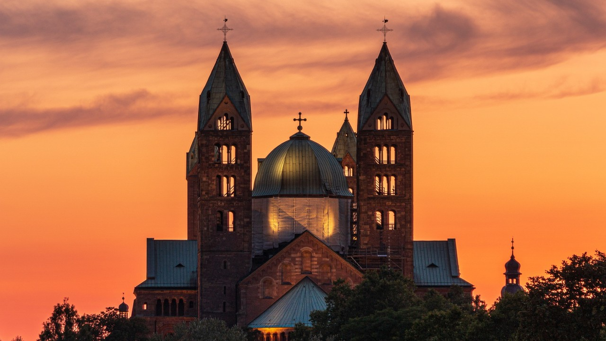

• [Published on May 31, 2020](https://www.linkedin.com/pulse/awesome-ways-build-resplendent-cathedrals-ubellah-maria/)

“We who cut mere stones must always be envisioning cathedrals.”
We are always struck by striving to do the ‘best job of stone cutting’, or merely ‘making a living’. Let's be the precious few who are ‘building the cathedral’.

- **Are** your days driven by just “to do's” ,“shoulds,” and “have to's”?
- **Are** you feeling bored and blasé about your work more often than you feel excited about it?
- **Are** you struggling to find motivation in the job you do daily? or Do you hate your job?
Then, read on...

This is the parable of the *three stone cutters* , as popularized by **Peter Drucker, ** the writer and management consultant in his book, **[The Practice of Management](https://www.goodreads.com/book/show/48018.The_Practice_of_Management)** . There are numerous versions of this parable on the internet and here's my adapted version:

Once, there were three stone cutters working together on a job. A stranger came upon the <u>first stone cutter</u> and asked, “What is it that you’re doing?”. “ ***Cutting this stone into a square*** . It’s how I spend my days” he said gruffly. When his day ended, he was happy to get his pay and leave. His blocks lacked some of the smoothness of the other masons.

The stranger moved on. He soon came upon the second stone cutter, who was also working diligently on his own pile of stones. “What are you doing?” asked the stranger, interested to see how this stone cutter would respond.

The <u>second stone cutter</u> stopped to look at the stranger and engage in the conversation. “I’m told that this block will help form a doorway. I have a loving wife and two wonderful children that count on me. I ***work hard to make sure*** * * ***we have what we need*** * * and can take time to enjoy each other. I also know that I ***am doing the best job of stone cutting*** * * in the entire country.” He enjoyed his work, was proud of his achievements, but looked forward to get home to his family.

Around the outer edge of the site, the stranger saw a <u>third stone cutter</u> who was squatting behind a large carved stone, but staring toward the horizon. The stranger approached this stone cutter and asked, “Pardon me. May I ask what you’re working on?”

“I am ***building a Cathedral*** ,” responded the third stone cutter without breaking his gaze toward the horizon, and into the future. “It’s going to be the place of worship for the people and it will stand for centuries. My role is small, but I’ve been given an ***opportunity to leave a lifetime’s legacy.*** ”

The stranger left the building site reflecting on how much a *positive purpose and vision * could contribute to our satisfaction and happiness.

### This parable always gets me to contemplate –

> “What Cathedrals am I building at work?”
> “Am I just doing what I need to do?”
> “Am I building a legacy that I will be proud of having been a part of it?”
## Time to reflect.......

## 1. Life is all about perception

***“The real voyage of discovery consists not in seeking new lands but in seeing with new eyes.” – Marcel Proust***

Infact, all the three workers were doing the same task. All it takes is a moment to ***change your lens*** and look at the situation in a new frame.

Perspective can either make your problems look bigger or your ***possibilities look infinite*** .

## 

## 2. Understand the 'Big Picture'

***“What is behind your eyes holds more power than what is in front of them.” – Gary Zukav***

It is just not about “fair day’s work for a fair day’s pay” or being that 'awesome engineer' or subject matter expert.

All of us work to make money and many of us are passionate about our work and master our crafts diligently.  If you are a server at a restaurant, try to think about why you need to provide an excellent experience for your customer. You can brighten their day. This holds good for any field that you work in.

What makes all the difference is to have the visionary gleam in our eyes - *** 'why' we do what we do in our work.***

## 

## 3. Live with a bigger purpose

***“The mystery of human existence lies not in just staying alive, but in finding something to live for.” ―Fyodor Dostoyevsky***

The choice of a bigger purpose in life has the power to transform not only the way we look at our job, but the ***quality of our work*** as well.

If the purpose of the third stone cutter could help him transcend even a physically laborious task as the one undertaken in the parable to great heights, then imagine the *** impact*** what a bigger purpose can have on our work, and on that of our employees.

Be it leaders or otherwise - choose your bigger purpose!!!

## 

## 4. Attitude is all that matters

***“The greatest discovery of all time is that a person can change his future by merely changing his attitude.” – Oprah Winfrey***

Very little is needed to make a happy life; it is all within yourself, in your way of thinking. Our minds are the reason of the lives we live.

How many times did we try to fit ourselves into some predetermined path in life, just because someone else steered us that way? Let's ***break the monotony*** .

Start looking for what makes you tick, and do more of it, looking no further than the intrinsic satisfaction you get every time you engage in it. ***Shine in your own way.***

## 

## 5. Leave a lifetime's legacy

***“The great use of life is to spend it for something that will outlast it.” —William James***

Be it a software, a team or whatever - ***build them as you build a Cathedral*** .

Chart out a plan, choose the appropriate architecture principles, consider environmental changes, make it scalable, choose the right people with right skills, ensure quality assurance, make it an enduring legacy of art.

***Start seeing the invisible - beyond what is clearly obvious and start doing the impossible.***

Basically, it boils down to - Know your ***‘why’*** .

**Ask yourself :**

1. Why is this task or project important?

2. Whom does it impact and how?

3. How does it relate to my personal or professional life?

Be it personal or professional - let's choose to be ***"Cathedral Thinkers"*** *.*

